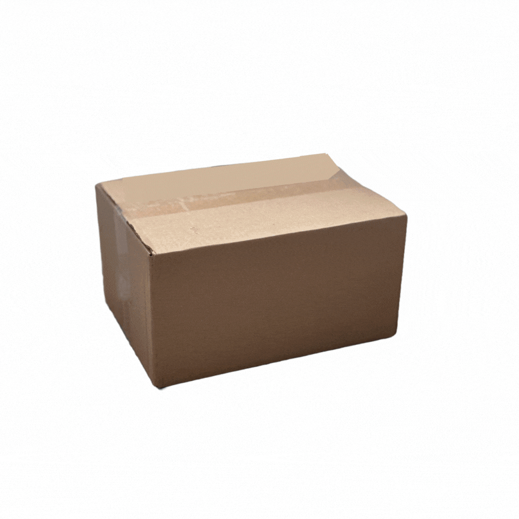

# ProjectMUSEEG
*Welcome to Project MUSEEG! (Pronounced Muse-EGG) *   
***Project A***   
*Music is already known to help with anxiety, focus, and relaxation—but what if it could be tailored to an individual’s brain activity? Brainwaves provide measurable indicators of emotional states like stress, restlessness, and calm. By collecting EEG data and training a neural network, I aim to create a system that detects these emotional states and generates personalized music designed to counteract them. The long-term goal is to explore applications in mental health, where this system could be used in hospitals, therapy settings, or for personal well-being. Since neurotechnology isn’t one-size-fits-all, this research is a step toward more personalized solutions in brain-music interaction.*   
***Project B***
*Ever wondered if someone could hear your thoughts? While we’re not at the point of translating thoughts into words, we can start by turning brain activity into music. Since music is a universal language, this research will explore how EEG data can be converted into sound patterns. By mapping electrical brain signals to musical structures, we lay the groundwork for future nonverbal communication systems. This could eventually evolve into a tool for individuals who struggle with verbal communication, but for now, the focus is on understanding the underlying brain-music relationship.*   
## Phase 1: Research
*[Bibliography](https://docs.google.com/document/d/126_Q5-wPVYQXYX758TkZR0ndfYQ_7DFlI9uJoeaBVlY/edit?usp=sharing) of useful resources.*
## Phase 2: Hardware 

|Material Link                       | What's Included                                                                   | Cost                        |
| --------                           | -------                                                                           | -------                     |
| [Ultracortex "Mark IV" EEG Headset](https://shop.openbci.com/products/ultracortex-mark-iv?variant=23280741699)  | <ul><li> EEG nodes</li><li>Ear clips</li><li>Screws</li><li>Ribbon Cables</li></ul> |$900                         |
| [Daisy + Cyton BioSensing Board](https://shop.openbci.com/products/cyton-daisy-biosensing-boards-16-channel?variant=38959256526)    | <ul><li>Cyton+Daisy board (able to receive data from 16 different channels/points on brain)</li><li>Rechargeable Lithium Battery</li><li>Charging pack (for battery)</li><li>Programmable Dongle (Bluetooth communication)</li><li>Y-splitter cable</li><li>Board cover</li></ul> | $2100|
|[USB-A to USB-C Converter](https://www.bestbuy.com/site/insignia-usb-c-to-usb-adapter-black/6473492.p?skuId=6473492&extStoreId=46&utm_source=feed&ref=212&loc=18670532085&gad_source=1&gad_campaignid=18673989082&gbraid=0AAAAAD-ORIiROXi48bwZ1xsDqw0y9IgxL&gclid=Cj0KCQjwjo7DBhCrARIsACWauSmR3vUUhmtopa0tZ__U4yZM3AUu9UiuOb3mSAOf0FKv1AXDpcI0BTkaAo3EEALw_wcB&gclsrc=aw.ds) | <ul><li>USB-A to USB-C Converter</li></ul> | $10 |
|Gorilla Glue | Super Glue | $4 |

## Phase 3: Implementing Software
*connecting with the free OpenBCI Software*
*retrieving, and storing data*
*analyzing data with Neural Network*
*maybe creating simole program utilizing this information*
# Project A: Musical Therapy
## Phase 4: Collecting Data (relevant to project)
## Phase 5: Analyzing Data (relevant to project)
# Project B: Brain Wave to Music Interpretation
## Phase 4: Collecting Data (relevant to project)
## Phase 5: Analyzing Data (relevant to project)
